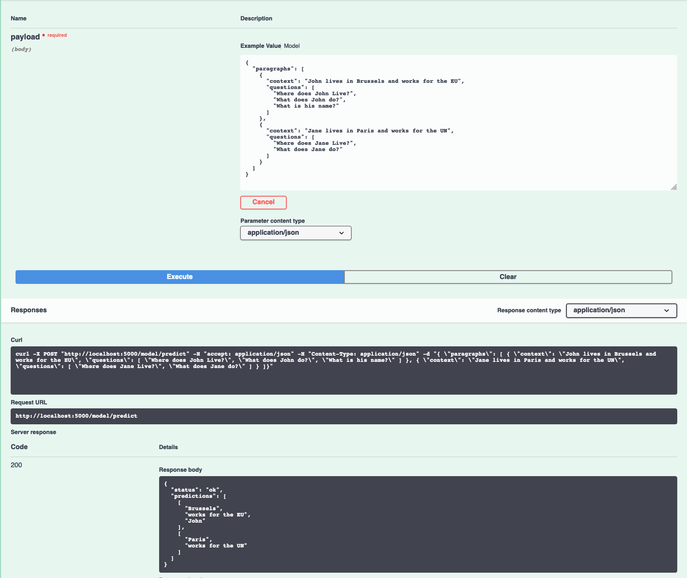

[](https://travis-ci.com/IBM/MAX-Question-Answer) [](http://max-question-answer.max.us-south.containers.appdomain.cloud/)

[](http://ibm.biz/max-to-ibm-cloud-tutorial)

# IBM Developer Model Asset Exchange: Question Answering Model

This repository contains code to instantiate and deploy a Question Answering model. Given a body of text (context) about a subject and questions about that subject, the model will answer questions based on the given context.

The model is based on the [BERT model](https://github.com/google-research/bert). The model files are hosted on
[IBM Cloud Object Storage](https://s3.us-south.cloud-object-storage.appdomain.cloud/max-assets-dev/max-question-response/1.0.0/assets.tar.gz).
The code in this repository deploys the model as a web service in a Docker container. This repository was developed
as part of the [IBM Developer Model Asset Exchange](https://developer.ibm.com/exchanges/models/) and the public API is powered by [IBM Cloud](https://ibm.biz/Bdz2XM).

## Model Metadata
| Domain | Application | Industry  | Framework | Training Data | Input Data Format |
| ------------- | --------  | -------- | --------- | --------- | -------------- | 
| Natural Language Processing | Question and Answer | General | TensorFlow | [SQuAD 1.1](https://rajpurkar.github.io/SQuAD-explorer/) | Text |

_Note: the SQuAD 1.1 files are no longer on the dataset website but can be found on the [Google BERT](https://github.com/google-research/bert) repo_

## Benchmark

The predictive performance of the model can be characterized by the benchmark table below.

_Note: The performance of a model is not the only significant metric. The level of bias and fairness incorporated in the model are also of high importance. Learn more by reading up on the [AI Fairness 360 open source toolkit](http://ibm.biz/AI_Fairness_360)._

On datasets where the answers given are designed to not be exact matches to a span of text from the given context (MS MARCO), the model does not perform as well, since SQuAD 1.1 is a span-matching task.

|  | SQuAD 1.1 | TriviaQA 1.0 for RC   | MS MARCO  |
| -------- | --------  | -------- | --------- |
| f1 Score | 88.7 | 60.9| 40.7 |
| Exact Match | 81.5 | 53.8 | 9.4 |

## References

* _J. Devlin, M. Chang, K. Lee, K. Toutanova_, ["BERT: Pre-training of Deep Bidirectional Transformers for Language Understanding"](https://arxiv.org/abs/1810.04805), arXiv, 2018.
* [Google BERT](https://github.com/google-research/bert)
* [SQuAD Dataset](https://rajpurkar.github.io/SQuAD-explorer/) and version 1.1 on the [Google BERT](https://github.com/google-research/bert) repo

## Licenses

| Component | License | Link  |
| ------------- | --------  | -------- |
| This repository | [Apache 2.0](https://www.apache.org/licenses/LICENSE-2.0) | [LICENSE](LICENSE) |
| Fine-tuned Model Weights |  [Apache 2.0](https://www.apache.org/licenses/LICENSE-2.0) | [LICENSE](LICENSE)
| Pre-trained Model Weights |  [Apache 2.0](https://www.apache.org/licenses/LICENSE-2.0) | [LICENSE](https://github.com/google-research/bert/blob/master/LICENSE)
| Model Code (3rd party) | [Apache 2.0](https://www.apache.org/licenses/LICENSE-2.0) | [LICENSE](https://github.com/google-research/bert/blob/master/LICENSE) |
| Test samples | [CC BY-SA 4.0](https://creativecommons.org/licenses/by-sa/4.0/legalcode) | [samples README](samples/README.md) |

## Pre-requisites:

* `docker`: The [Docker](https://www.docker.com/) command-line interface. Follow the [installation instructions](https://docs.docker.com/install/) for your system.
* The minimum recommended resources for this model is 2 GiB Memory and 4 CPUs.

# Steps

1. [Deploy from Docker Hub](#deploy-from-docker-hub)
2. [Deploy on Kubernetes](#deploy-on-kubernetes)
3. [Run Locally](#run-locally)

## Deploy from Docker Hub

To run the docker image, which automatically starts the model serving API, run:

```
$ docker run -it -p 5000:5000 codait/max-question-answering
```

This will pull a pre-built image from Docker Hub (or use an existing image if already cached locally) and run it.
If you'd rather checkout and build the model locally you can follow the [run locally](#run-locally) steps below.

## Deploy on Kubernetes

You can also deploy the model on Kubernetes using the latest docker image on Docker Hub.

On your Kubernetes cluster, run the following commands:

```
$ kubectl apply -f https://github.com/IBM/MAX-Question-Answering/raw/master/max-question-answering.yaml
```

The model will be available internally at port `5000`, but can also be accessed externally through the `NodePort`.

A more elaborate tutorial on how to deploy this MAX model to production on [IBM Cloud](https://ibm.biz/Bdz2XM) can be found [here](http://ibm.biz/max-to-ibm-cloud-tutorial).

## Run Locally

1. [Build the Model](#1-build-the-model)
2. [Deploy the Model](#2-deploy-the-model)
3. [Use the Model](#3-use-the-model)
4. [Run the Notebook](#4-run-the-notebook)
5. [Development](#5-development)
6. [Cleanup](#6-cleanup)


### 1. Build the Model

Clone this repository locally. In a terminal, run the following command:

```
$ git clone https://github.com/IBM/MAX-Question-Answering.git
```

Change directory into the repository base folder:

```
$ cd MAX-Question-Answering
```

To build the docker image locally, run: 

```
$ docker build -t max-question-answering .
```

All required model assets will be downloaded during the build process. _Note_ that currently this docker image is CPU only (we will add support for GPU images later).


### 2. Deploy the Model

To run the docker image, which automatically starts the model serving API, run:

```
$ docker run -it -p 5000:5000 max-question-answering
```

### 3. Use the Model

The API server automatically generates an interactive Swagger documentation page. Go to `http://localhost:5000` to load it. From there you can explore the API and also create test requests.

Use the `model/predict` endpoint to upload a test json file (you can use/alter the files from the `samples` folder) and get answers to the questions from the API.

Sample input:
```json
{
  "paragraphs": [
    {
      "context": "John lives in Brussels and works for the EU",
      "questions": [
        "Where does John Live?",
        "What does John do?",
        "What is his name?"
      ]
    },
    {
      "context": "Jane lives in Paris and works for the UN",
      "questions": [
        "Where does Jane Live?",
        "What does Jane do?"
      ]
    }
  ]
}
```



You can also test it on the command line, for example:

```shell
$ curl -X POST "http://localhost:5000/model/predict" -H "accept: application/json" -H "Content-Type: application/json" -d "{\"paragraphs\": [{ \"context\": \"John lives in Brussels and works for the EU\", \"questions\": [\"Where does John Live?\",\"What does John do?\",\"What is his name?\" ]},{ \"context\": \"Jane lives in Paris and works for the UN\", \"questions\": [\"Where does Jane Live?\",\"What does Jane do?\" ]}]}"
```

You should see a JSON response like that below:

```json
{
  "status": "ok",
  "predictions": [
    [
      "Brussels",
      "works for the EU",
      "John"
    ],
    [
      "Paris",
      "works for the UN"
    ]
  ]
}
```

### 4. Run the Notebook

[The demo notebook](samples/demo.ipynb) walks through how to use the model to run inference on a text file or on text in-memory. By default, the notebook uses the [hosted demo instance](http://max-question-answering.max.us-south.containers.appdomain.cloud), but you can use a locally running instance as well. _Note_ the demo requires `jupyter`, `pprint`, `json` and `requests`.

Run the following command from the model repo base folder, in a new terminal window:

```
$ jupyter notebook
```

This will start the notebook server. You can launch the demo notebook by clicking on `samples/demo.ipynb`.


### 5. Development

To run the Flask API app in debug mode, edit `config.py` to set `DEBUG = True` under the application settings. You will then need to rebuild the docker image (see [step 1](#1-build-the-model)).

### 6. Cleanup

To stop the Docker container, type `CTRL` + `C` in your terminal.